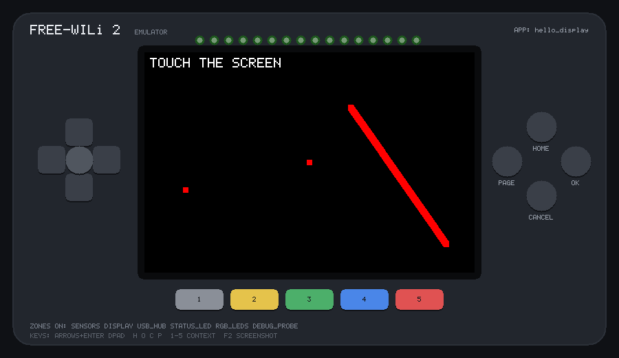

# freewili2-emu

**Run [FREE-WILi 2](https://freewili.com) apps before the hardware is in hand.**

An emulator for the FREE-WILi 2's DISPLAY processor. Apps written with
[WiliBSP](https://github.com/freewili/wilibsp) compile **unmodified** against
it and run in a desktop window, headless for tests and AI agents, or in a
browser.

> **Unofficial.** This is a community project, not affiliated with FREE-WILi
> LLC. If an app behaves differently here than on a real board,
> [open an issue here](https://github.com/dfdarty/freewili2-emu/issues) —
> not with FREE-WILi.

**[Documentation](https://dfdarty.github.io/freewili2-emu/)** ·
**[Try it in your browser](https://dfdarty.github.io/freewili2-emu/emulator/)** (WiliBSP example apps; build the emulator to test your own) ·
[App compatibility](https://dfdarty.github.io/freewili2-emu/compatibility/)



## Quick start

```sh
sudo apt install git cmake ninja-build libsdl2-dev zlib1g-dev python3
git clone --recurse-submodules https://github.com/dfdarty/freewili2-emu
cd freewili2-emu
cmake -S . -B build -G Ninja && cmake --build build
build/bin/hello_display                 # a WiliBSP example app, in a window
```

Your own app, from folder to hardware check. It starts from WiliBSP's
template, which logs `app: power zones ready` once it is up:

```sh
mkdir -p apps/hello_mine && cp -r third_party/wilibsp/apps/template/. apps/hello_mine/
sed -i 's/\btemplate\b/hello_mine/g' apps/hello_mine/CMakeLists.txt
cat > apps/hello_mine/test.txt <<'EOF'
wait 3000
expect "power zones ready"
quit
EOF
tools/fw2emu run apps/hello_mine --run-ms 5000        # build and run it (5 s; without --run-ms, until you close it)
tools/fw2emu run apps/hello_mine --headless --script apps/hello_mine/test.txt && echo PASS
tools/fw2emu hwcheck --fetch-toolchain apps/hello_mine   # check it fits the real chip
```

The [first-app tutorial](https://dfdarty.github.io/freewili2-emu/first-app/)
goes further: buttons, LEDs, and `expect` on the app's own output. No
display (SSH, a container)? The emulator notices and runs headless.

- `hwcheck` needs Arm GCC: `--fetch-toolchain` downloads the Arm GNU
  Toolchain 14.2.Rel1 that WiliBSP uses, or install the distribution's
  `gcc-arm-none-eabi`.
- The browser build needs Emscripten 4.0.15 (emsdk), or use the Dockerfile:
  `docker build -t freewili2-emu .`

It can't run `.uf2` files (apps are rebuilt from source), and it doesn't model
radios, USB host, DVI output or the CPU's real speed — check those on the
board. On Windows it runs in WSL2 ([steps](https://dfdarty.github.io/freewili2-emu/windows/));
or open the repository in **GitHub Codespaces** for a ready-made
environment. VS Code tasks and a debug setup come with it. See [Install and run](https://dfdarty.github.io/freewili2-emu/getting-started/).

## What's in it

- The display, touch screen, 14 buttons, 16 RGB LEDs, four sensors, audio
  codec with speaker and jack, four PDM microphones, power zones, charger
  status and 8 MB PSRAM — modelled at the bus and protocol level, so
  WiliBSP's drivers run as shipped.
- Both RP2350 cores (`pico/multicore.h`, FIFOs, locks, queues), and SPI/I2C
  at their real clock rates with a live bus-load readout, so an app that
  draws faster than the LCD bus allows is slow here too.
- Sensor-log playback: feed a recorded flight, drive or walk (CSV) into the
  sensors, or use the built-in model-rocket flight.
- 13 of WiliBSP's 17 example apps run, including the SD card, header GPIO
  and VIO apps over the MAIN processor link (OneWili), and `retrochat` on
  both cores. The radios are next. [Details](https://dfdarty.github.io/freewili2-emu/compatibility/).
- WiliBSP's `fw.py press / touch / type / screenshot` work against it over RTT,
  for apps that call `agentio_init()` (as on the board).
- A GitHub Action for your own app repository (`uses: dfdarty/freewili2-emu@v1`):
  every push builds the app, runs its test script headless and keeps the
  screenshots ([Testing in CI](https://dfdarty.github.io/freewili2-emu/ci/)).
- `fw2emu hwcheck` builds your app with the real Pico SDK and Arm GCC and
  reports SRAM, PSRAM and worst-case stack against the RP2350's limits.
- Sanitizer and 32-bit builds to catch memory and pointer-size bugs before
  they reach the board.

## License

MIT (see [LICENSE](LICENSE)). WiliBSP is MIT, © 2026 Dave Robins. Bundled and
fetched third-party components keep their own licenses (see
[THIRD-PARTY-NOTICES.md](THIRD-PARTY-NOTICES.md)). FREE-WILi is a trademark of
FREE-WILi LLC.
