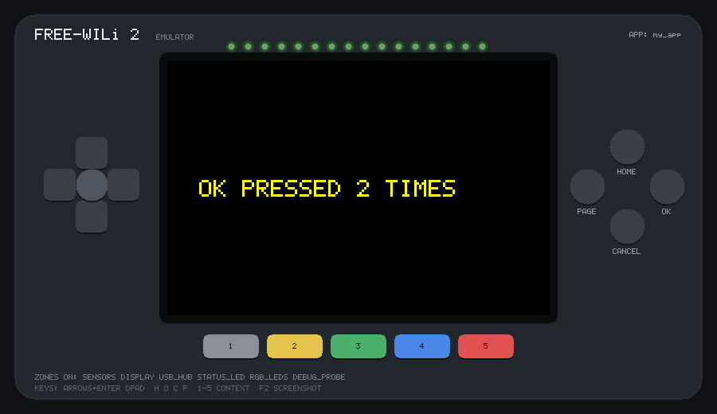

# Your first app

An emulator app **is** a WiliBSP app: the same folder, the same
`CMakeLists.txt` and the same `main.c` build for the emulator and, with
WiliBSP's own toolchain, into a UF2 for the board.

!!! tip "The quick way"
    `tools/fw2emu new apps/my_app` creates this whole app, test included, in
    one step. For an app in its own GitHub repository, start from
    `tools/fw2emu new --repo ~/my_app`, which also sets up the
    [GitHub Action](ci.md). The steps below show what's in it.

## 1. Make the folder

Put it in `apps/` inside the repository, or anywhere else and use
`tools/fw2emu run`. Every folder in `apps/` that has a `CMakeLists.txt` is
built with the rest: `cmake --build build` notices a new one and
re-configures by itself.

```sh
mkdir -p apps/my_app
```

`apps/my_app/CMakeLists.txt`:

```cmake
add_executable(my_app main.c)
target_link_libraries(my_app freewili2_bsp)
fw2_display_app(my_app
    POWER_ZONES DISPLAY RGB_LEDS
    VERSION 001
    DESCRIPTION "Counts OK presses and colours the LEDs")
```

`fw2_display_app()` checks the same things WiliBSP's does: a three-digit
version, a description, and valid power-zone names. `POWER_ZONES` lists the
rails your app needs; WiliBSP's start-up code asks the board-manager chip to
switch them on, and the emulator models that handshake, so a part whose zone
you forget stays dark here too.

## 2. Write `main.c`

```c
#include "fw2.h"
#include "hardware/pio.h"
#include "platform/diag.h"
#include <stdio.h>

// The LCD driver takes RGB565 colours in wire (big-endian) byte order.
static inline uint16_t be16(uint16_t c) { return (uint16_t)((c >> 8) | (c << 8)); }

int main(void) {
    board_init();
    fw2_app_recovery_init();          // HOME held 5 s exits; also starts the button link
    st7796_init();
    fw2_app_about_use_lcd();
    st7796_fill_screen(be16(0x0000));
    board_backlight_set(1);

    ws2812_init(pio1, 0, PIN_LED_DATA);
    ws2812_set_brightness(64);

    unsigned count = 0;
    rgb_t colour = { .r = 0, .g = 0, .b = 255 };
    bool redraw = true;

    for (;;) {
        fw2_app_recovery_task();

        uartkbd_event_t ev;
        while (uartkbd_next_event(&ev)) {
            if (!ev.pressed) continue;
            if (ev.btn == UARTKBD_BTN_OK) { count++; redraw = true; }
            if (ev.btn == UARTKBD_BTN_GREEN) { colour = (rgb_t){ .r = 0, .g = 255, .b = 0 }; redraw = true; }
            if (ev.btn == UARTKBD_BTN_RED)   { colour = (rgb_t){ .r = 255, .g = 0, .b = 0 }; redraw = true; }
        }

        if (redraw) {
            char line[32];
            snprintf(line, sizeof line, "OK PRESSED %u TIMES", count);
            st7796_fill_rect(0, 140, 480, 40, be16(0x0000));
            st7796_draw_text(40, 150, 3, be16(0xFFE0), be16(0x0000), line);
            ws2812_fill(colour);
            ws2812_show();
            DIAG("count=%u\n", count);
            redraw = false;
        }
        tight_loop_contents();
    }
}
```

A few WiliBSP conventions this follows:

- Call `fw2_app_recovery_task()` every loop — it services the button link
  and makes **HOME held for 5 s** exit the app.
- Clear the screen before turning the backlight on.
- `DIAG()` goes to RTT, which the emulator prints to the terminal. It has no
  float formatting, as on the board.

## 3. Run it

```sh
tools/fw2emu run apps/my_app
```

The app uses three keys: ++o++ for OK, ++3++ for green and ++5++ for red.
Holding ++h++ (HOME) for 5 s exits it. See [Controls](controls.md) for every
key.



## 4. Test it automatically

`apps/my_app/test.txt`:

```text
wait 3000          # board_init and the power-zone handshake
press OK
press OK
expect "count=2"   # passes when the app logs it; fails the run after 2 s
press GREEN
wait 300
screenshot out/my_app.png device
quit
```

```sh
tools/fw2emu run apps/my_app --headless --script apps/my_app/test.txt
echo $?            # 0 passed, 1 an expect failed, 2 a mistake in the script
```

`expect` waits for a `DIAG()` (or emulator) line matching a regular
expression. If none arrives in time the run stops with exit status 1 and
says which line failed, so the script is a pass/fail test. Exit status 2
means the script itself (or a command-line option) has an error, for
example an unknown command or a word where a number should be. The
emulator prints the reason as `FATAL: script line N: …`. `# comments` can
follow any command. `out/my_app.png` is the whole front panel, LEDs
included; `out/` is created if needed. [Input scripts](scripting.md) has
every command, including touches and sensor changes.

Rather than writing it by hand, you can
[record it](scripting.md#recording-a-script): `tools/fw2emu run apps/my_app
--record apps/my_app/test.txt`, use the app, close the window, and
uncomment the `# expect` lines you want checked.

`tools/fw2emu test apps/my_app` runs the test in one step and says PASS or
FAIL. `tests/smoke.sh` also runs `apps/<app>/test.txt` for every app in
`apps/`, so your test runs with WiliBSP's examples. To run it on every push
of your own repository, use the [GitHub Action](ci.md).

## 5. Optional: make it drivable by WiliBSP's agent tools

WiliBSP's `fw.py press / touch / type / screenshot` (and agents that use
them) talk to an in-app harness called agentio. An app has to opt in with
three calls, on the board and in the emulator alike:

```c
    fw2_app_about_use_lcd();
    static fw2kb_t kb;                // agentio types through WiliBSP's keyboard engine
    fw2kb_init(&kb);
    agentio_init();                   // before drawing anything a capture should see
    agentio_bind_keyboard(&kb);
    ...
    for (;;) {
        ...
        agentio_task();               // serves press / touch / type / screenshot
        tight_loop_contents();
    }
```

Then start the app with `--rtt` in the background. `tools/fw2emu run`
builds first, so wait until it is serving RTT before you use `fw.py`:

```sh
tools/fw2emu run apps/my_app --rtt &
tools/fw2emu wait-rtt              # returns once the app is up (prints "RTT is up")
```

Then drive it from the repository root:

```sh
python3 third_party/wilibsp/tools/fw.py press ok
python3 third_party/wilibsp/tools/fw.py screenshot -o shot.png
kill %1                            # stop the app
```

If `fw.py` connects while the app is still starting, the emulator holds the
command until the app has called `agentio_init()`, so pasting both blocks
at once works too.

See [WiliBSP's agent tools](wilibsp-tools.md).

## 6. Check it fits the real chip

```sh
tools/fw2emu hwcheck --fetch-toolchain apps/my_app
```

`--fetch-toolchain` downloads the Arm GNU Toolchain 14.2.Rel1 that WiliBSP
builds with the first time (about 150 MB, into `~/.cache/fw2emu`); leave it
off to use an Arm GCC you have installed.

This builds the app with the real Pico SDK and Arm GCC and reports its SRAM
image, RAM, PSRAM and worst-case stack against the RP2350's limits — the
things the emulator itself can't tell you. It also leaves the real UF2 in
`build-hw/apps/my_app/`. See
[Debugging and hardware checks](debugging.md#real-hardware-check-toolsfw2emu-hwcheck).

## Starting from WiliBSP's template

WiliBSP's own starting point works the same way:

```sh
mkdir -p apps/my_template_app && cp -r third_party/wilibsp/apps/template/. apps/my_template_app/
sed -i 's/\btemplate\b/my_template_app/g' apps/my_template_app/CMakeLists.txt
tools/fw2emu run apps/my_template_app --run-ms 5000
```

The target name has to match the folder name everywhere in
`CMakeLists.txt`, which is what the `sed` line does. Inside a WiliBSP
checkout, `fw new-app NAME` does the same copy and rename.

## Writing it in C++

Name the files `.cpp` and list them in `add_executable()` as usual; the
emulator and WiliBSP's board build both compile C++. WiliBSP's headers
have no `extern "C"` guards, so wrap them, or the linker won't find
WiliBSP's functions (on the board as well as here):

```cpp
extern "C" {
#include "fw2.h"
#include "platform/diag.h"
}
#include <vector>
```

`tests/apps/cpp_check` is a small working example.
