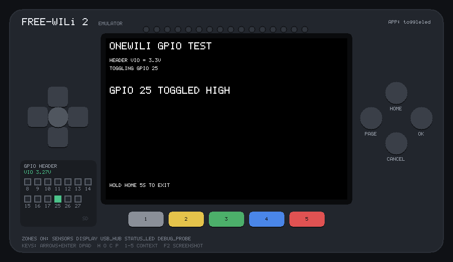
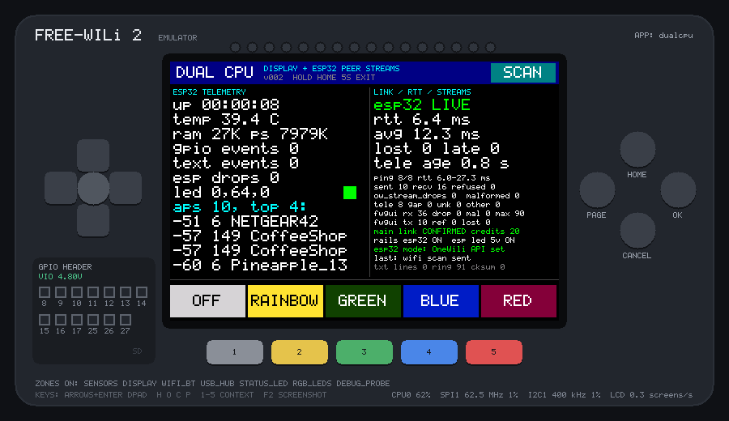

# The MAIN processor link

A FREE-WILi 2 has two RP2350s. WiliBSP apps run on the **display** CPU. The
**MAIN** CPU owns the SD card, the user GPIO header and the programmable
Vout. An app reaches the MAIN CPU through WiliBSP's OneWili client
(`libs/onewili`), over the FwGUI display link: UART0 at 8 Mbaud with
hardware flow control.

The MAIN firmware isn't public. The emulator provides a MAIN CPU that
answers the unmodified OneWili client **on the wire**, byte for byte
(`emu/src/dev_main.c`). The client library isn't changed or replaced, so
`ow_sd_*`, `ow_io_gpio_*` and the rest behave as they do on the board, up to
the limits below. `hello_sdcard`, `toggleled`, `hello_vref` and `dualcpu`
run unmodified.

## What's modelled

| Area | What works | OneWili calls |
|---|---|---|
| SD card | files and folders, backed by a folder on your PC | every `ow_sd_*` call: open/read/write/seek/close (two handles), whole-file get/put, stat, list, mkdir, remove, rename |
| Header GPIO | pins 8–17 and 25–27: drive, toggle, PWM, read back, stream | `ow_io_gpio_set_io_high/low/toggle`, `set_pwm`, `read_all`, `stream_io` (gpioReport binary events) |
| Header supply (VIO) | the rail chosen with `ioexp_vref()` on the display side, as the display's ADC monitor reads it | `ioexp_vref()`, `adc_read()` on inputs 5 (VIO) and 1 (Vout) |
| Programmable Vout | on/off and 1.0–5.5 V; the ANALOG power zone must be on | `ow_io_analog_out_set_v_prog_vout` |
| Wi-Fi and Bluetooth scans | the stock ESP32-C5 firmware's scans, over a scene of virtual networks and devices ([below](#wi-fi-and-bluetooth-scans)) | `ow_wireless_wifi_on_scan_for_access_points`, `ow_wireless_bluetooth_le_on_scan_bt_devices` (wifiscan / btscan text events) |
| Peer streams | MAIN's router between the display app and other OneWili clients: a stand-in ESP32, CM0 or PC ([below](#peer-streams-esp32-cm0-pc)) | `ow_stream_write`, `ow_stream_poll`, `ow_stream_drops`, `ow_wireless_e_sp32_mode` (`w\e`), `ow_hardware_system_stream_status` (`h\a\c`) |
| Power-zone refusals | `EPOWERZONE` for GPIO/analog commands, once the app has reported its zones | `ow_fwgui_send_power_zones` |
| Anything else | a well-formed failure reply: the call returns `OW_ERR_FAILED` at once instead of timing out after 5 s | the other ~480 generated commands |

The front panel shows the header: one square per pin (green = driven high,
outlined = driven low, blue = driven from outside, purple = PWM), the VIO
rail, Vout when it's on, and an **SD** light while the card is in use.



## The SD card folder

```sh
build/bin/hello_sdcard                      # card = ./sdcard
build/bin/hello_sdcard --sdcard ~/fw2card   # any folder
build/bin/hello_sdcard --sdcard none        # no card in the slot
```

- The folder is created the first time an app touches the card, with a
  `README.TXT` and a `samples/` folder (`hello.txt`, `readings.csv`). A
  folder that already exists is used as it is.
- SD paths map onto it: `/owlog/run.txt` is `sdcard/owlog/run.txt`. Names
  are matched without regard to case, as FAT does. Paths with `..` or with
  characters FAT forbids (`" * : < > ? | \`) are rejected
  (`SDFS_ERR_BAD_REQUEST`).
- The card only answers while the app's **SD Card** power zone (`SDCARD` in
  `POWER_ZONES`) is on. Otherwise every call fails with
  `SDFS_ERR_NO_CARD`, as it does for `--sdcard none`.
- Directory listings come back sorted by name. FAT returns directory order,
  which the host can't reproduce.
- In the browser the card is kept in memory: it starts with the sample
  files on every page load and disappears when you close the page.

`tests/smoke.sh` gives each app a fresh card in `out/sdcard-<app>`.

## Using the SD card from your app

Link the OneWili client, ask for the SD Card power zone, open the link, and
use the `ow_sd_*` calls. `tests/apps/sd_example` is this app plus a
read-back and a listing; the test suite runs it, and it also builds for the
board:

```cmake
add_executable(my_app main.c)
target_link_libraries(my_app freewili2_bsp onewili_fwgui)   # the OneWili client
fw2_display_app(my_app
    POWER_ZONES DISPLAY SDCARD                             # SDCARD powers the card
    VERSION 001
    DESCRIPTION "Logs to the SD card")
```

```c
#include "fw2.h"
#include "platform/diag.h"
#include "input/app_recovery_onewili.h"     /* onewili.h, onewili_sd.h + the link */
#include <stdio.h>

static ow_device dev;                       /* ~37 KB: static, never on the stack */

int main(void) {
    board_init();
    fw2_app_recovery_init();                /* waits for the SDCARD power zone */
    while (fw2_app_recovery_open_onewili(&dev) != OW_OK) fw2_app_recovery_sleep_ms(100);
    fw2_app_recovery_wrap_sd();

    ow_sd_mkdir(&dev, "/data");             /* fails harmlessly if it exists */
    ow_sd_file f;
    if (ow_sd_open(&dev, &f, "/data/log.csv", OW_SD_WRITE) == OW_OK) {
        for (int i = 0; i < 200; i++) {     /* one small write per line: each <= 1 KB */
            char line[32];
            int n = snprintf(line, sizeof line, "%d,%d\n", i, i * i);
            ow_sd_write(&f, line, (size_t)n);
        }
        if (ow_sd_close(&f) != OW_OK)       /* a lost write chunk shows up here */
            DIAG("close failed (sdfs %d)\n", (int)ow_sd_last_error());
    }
    for (;;) { fw2_app_recovery_task(); fw2_app_recovery_sleep_ms(100); }
}
```

Run it and the file appears in the card folder:

```sh
tools/fw2emu run apps/my_app --headless --run-ms 8000
cat sdcard/data/log.csv
```

- **Keep each `ow_sd_write()` to 1 KB or less.** The OneWili client that
  WiliBSP ships sends a whole write as one burst. A burst of more than a few
  KB can overrun the MAIN CPU's receive buffer while the card is busy, and
  `ow_sd_close()` then reports `SDFS_ERR_IO`. This happens on the board too
  ([link timing](#link-timing)); the newer upstream client batches writes
  for you.
- **Always check `ow_sd_close()`.** Writes are fire-and-forget, so a lost
  chunk shows up there, not at `ow_sd_write()`.
- `ow_sd_get_mem()` / `ow_sd_put_mem()` read and write a whole file without
  a handle; `ow_sd_stat()`, `ow_sd_list()`, `ow_sd_remove()` and
  `ow_sd_rename()` need no handle either. Paths are absolute (`/data/…`),
  and at most two files can be open at once.
- The SD calls use little stack (about 1.1 KB worst case in `hwcheck`),
  unlike the OneWili text commands ([below](#checking-it)).

## Header GPIO and VIO

The header is level-shifted. The shifters are powered by **VIO**, which the
display CPU selects with `ioexp_vref()` (WiliBSP invariant 11). Without VIO,
MAIN still toggles its pin and `ow_io_gpio_read_all()` still reports the new
level, but the header pin doesn't move. The emulator reproduces this: the
panel shows "VIO OFF: PINS DEAD" and the pin squares go dim.

VIO and Vout values are the ones measured on a bench unit (WiliBSP's
`docs/superpowers/findings/2026-07-26-gpio-vref-e2e.md`):

| `ioexp_vref()` | VIO | ADC input 5 reads |
|---|---|---|
| `VREF_NONE` | 0 V | ~25 mV |
| `VREF_3V3` | 3.27 V | ~3290 mV |
| `VREF_5V0` | 4.83 V | ~4850 mV |
| `VREF_EXT_PIN` | whatever is on Trig_IN/VREF; 4.80 V with nothing connected, as measured | ~4825 mV |
| `VREF_PROG_VOUT` | the programmable Vout (0 V while it's off) | ~25 mV |

`read_all` returns the full 32-bit `gpio_get_all()` value. Bits that aren't
header pins, and header pins nobody drives, read as they did on that bench
unit (`0xE0FF21F3` with GPIO 25 low). Drive a pin from outside to test an
input:

```sh
build/bin/my_app --sensor gpio12=1          # at start-up; gpio12=-1 releases it
```

```
set gpio12 1        # in a script: 1 high, 0 low, -1 not driven
set vrefext 3.3     # volts on the Trig_IN/VREF pin (-1 = nothing connected)
header              # log every pin, VIO and Vout
```

The web page has the same controls under **GPIO header inputs**.

## Link timing

- **MAIN → display.** Bytes leave at 8 Mbaud and stop while the display's
  32-byte receive FIFO is full, which is the display's RTS. MAIN works
  through one request at a time and waits while its reply is still going
  out.
- **Display → MAIN.** MAIN receives into a 2048-byte DMA ring. The ring
  never pauses the sender, and when it's full the oldest bytes are lost.
- **Card busy periods.** The card goes busy for 6 ms after every 16 KB
  written, and MAIN stops reading the link while it waits.

Together these reproduce a real hardware failure. The OneWili client that
WiliBSP ships sends a whole `ow_sd_write()` as one burst. If the card goes
busy for more than about 2.5 ms during a burst, bytes arrive faster than
MAIN takes them, the ring overruns, and chunks are lost. `ow_sd_close()` then
fails with `SDFS_ERR_IO`, or the call times out if the final chunk was lost.
In the emulator the card goes busy after every 16 KB written, so a single
write that spans one of those points fails. On the board it depends on the
card. The upstream client in
github.com/freewili/onewili batches writes to fix this.
With the version WiliBSP ships, **write in pieces of 1 KB or less**, as
`tests/apps/main_link_check` does. The emulator logs
`main: receive ring overrun` when this happens.

## The board clock

The board manager keeps a real-time clock, which apps reach through MAIN:
`ow_hardware_get_time()` (`h\t`) and `ow_hardware_set_time()` (`h\c`).
The emulator's clock starts at the PC's local time, or at
[`--rtc "2027-05-16 09:30:00"`](cli.md) for a run that must give the same
dates every time, and runs with emulator time. Setting it moves it for the
rest of the run; the weekday is worked out from the date, as on the board.
Dates outside 2000–2099 are refused.

Both calls are generated text commands, so they need about 10 KB of stack
(see below): use them from an app built with `fw2_psram_app()`, whose stack
has the SRAM to itself.

## Wi-Fi and Bluetooth scans

The radios are on the ESP32-C5, behind MAIN. An app asks MAIN for a scan
and the results come back as text events, which `ow_poll_text_line()`
returns one at a time:

| Call | Then, for each network or device |
|---|---|
| `ow_wireless_wifi_on_scan_for_access_points(&dev)` | `wifiscan`: `<bssid> <rssi> <channel> <band> <authmode> <ssid>` |
| `ow_wireless_bluetooth_le_on_scan_bt_devices(&dev, ms)` | `btscan`: `<name> <mac> <rssi>` |

Events are framed like replies, so the `args` that `ow_poll_text_line()`
gives you are `<timestamp> <sequence> <fields…> <ok>`: skip the first two
words and drop the last. An SSID or a device name can contain spaces or be
empty, so split a `wifiscan` from the front (the SSID is last) and a
`btscan` from the back (the name is first). Poll often: the client keeps
only the last 8 events it hasn't been asked for.

What's in range is a scene of virtual access points and devices:

```text
# ap  BSSID              channel  authmode  RSSI  SSID
ap    3c:37:86:12:34:56  6        3         -52   NETGEAR42
ap    44:d9:e7:ab:cd:02  36       7         -71   Hernandez Family 5G
# ble MAC                RSSI  [name]
ble   5c:f3:70:a1:b2:c3  -63   Galaxy Buds2
ble   7d:4c:21:9e:0a:11  -77
```

Load one with `--radio scene.txt`, or `--radio @town` for a built-in
neighbourhood with a few things a surveillance detector would flag. A
script (or the web page's command line) changes it while the app runs:
`radio ap …`, `radio ble …`, `radio rssi MAC -40` (walk towards it),
`radio remove MAC`, `radio clear`, `radio load FILE`.

Each scan reports everything in the scene once, with up to ±3 dB of jitter
from a fixed seed, so a test gets the same numbers every run. A Wi-Fi scan
takes 1.2 s; a Bluetooth scan spreads its results over the time you asked
for.

Modelled from WiliBSP's generated client, the upstream OneWili docs and the
Python client's framing; not yet checked against a board:
- `band` is `2` or `5` (GHz) and `authmode` is ESP-IDF's `wifi_auth_mode_t`
  (0 open, 1 WEP, 3 WPA2-PSK, 6 WPA3-PSK, 7 WPA2/WPA3, …).
- The upstream docs say both scans need power zone 5 (ESP32), which a
  WiliBSP app has no `POWER_ZONES` name for; the emulator doesn't refuse
  them.
- The scans report what the stock firmware reports: no advertisement data,
  no raw frames, and only access points, not the devices talking to them.

## Peer streams (ESP32, CM0, PC)

WiliBSP apps can be one half of a combined app: the display CPU and the
ESP32-C5 (or the CM0 Linux module, or a PC) exchange datagrams of 1–128
bytes that MAIN routes between them. OneWili's `ow_stream_write()` sends
one to a peer (`OW_PEER_ESP32`, `OW_PEER_CM0`, `OW_PEER_HOST`, or the
display itself) and `ow_stream_poll()` returns the next one that arrived,
with the sender's id. WiliBSP's `dualcpu` is the example.

The emulator's MAIN routes them as the stream contract in OneWili's
`ow_stream_wire.h` says:

- The display's link opens with the client's HELLO, which MAIN answers
  with a CREDIT, and stays open while stream frames keep coming (the client
  sends a HELLO every second while it polls). After 3 s of silence MAIN
  closes it.
- MAIN answers every data frame with a CREDIT. That moves the client's
  768-unit window on, and carries MAIN's drop totals for
  `ow_stream_drops()`.
- MAIN drops a datagram, and counts it, when it's addressed to MAIN
  itself, or to a peer that isn't there. The ESP32 is only there with its
  power zone (5) on and **Wireless > ESP32 Mode** set to OneWili API
  (`ow_wireless_e_sp32_mode(&dev, 1)`, which `dualcpu` sends at start).
  A datagram for the display while its link is closed is dropped as well.

The other clients are stand-ins, chosen with `--peer`:

| `--peer` | What's at the other end |
|---|---|
| `esp32=dualcpu` | the ESP32 half of `dualcpu`: answers PING with PONG, sends telemetry once a second (uptime, temperature, free RAM and PSRAM, its LED, and the strongest networks of a Wi-Fi scan of the [radio scene](#wi-fi-and-bluetooth-scans)), sets its LED, scans on SCAN_NOW |
| `esp32=script`, `cm0=script`, `host=script` | an [input script](scripting.md): `stream esp32 01 02 03` or `stream cm0 "hello"` sends a datagram to the app, and every datagram the app sends there is logged for `expect` |

```text
$ build/bin/dualcpu --peer esp32=dualcpu --radio @town
$ build/bin/myapp --peer esp32=script --script test.txt
...
[emu] stream: display -> esp32 (8 bytes): 68 69 20 65 73 70 33 32  |hi esp32|
```



On the ESP32 link, a datagram takes 2.6 ms each way. So `dualcpu`'s PING
comes back in about 5.5 ms plus however long the app takes to poll again.
On a board, `dualcpu` shows 6.0 ms. In the emulator it's often more,
because its screen update runs in the same loop pass as the PING, and the
emulator's estimate of that drawing code's speed is on the slow side (see
[CPU speed](debugging.md#is-it-fast-enough-cpu-speed)). A CM0 or PC
datagram takes 1 ms. `-v` logs the link opening and closing, and every
drop with its reason.

Modelled from OneWili's stream client and `ow_stream_wire.h`, and
`dualcpu`'s protocol; not yet checked against MAIN's router:

- **Inferred:** `h\a\c` reports the display link's own totals (MTU 128,
  nothing queued). The display uses pushed CREDITs instead, and only falls
  back to `h\a\c` on links without them.
- The CM0 and PC text commands `h\a\w` and `h\a\p` aren't modelled; no
  emulated client uses them.
- The stand-in's telemetry values are plausible, not measured. The
  temperature rises from 39.5 °C to about 42 °C over five minutes, and
  GPIO and text-event mirroring counts stay at 0.

## Checking it

- `-v` logs every OneWili response (`main: [i\g\t 00000001F681D880 3 Ok 1]`),
  GPIO changes, VREF and Vout. `-vv` also logs each SD request.
- `tests/apps/main_link_check` is a self-test built next to the example
  apps. It runs 67 checks through the unmodified client: every SD operation
  and its errors, GPIO, PWM, streamed reports, Vout, the board clock,
  Wi-Fi and Bluetooth scans, `EPOWERZONE` and an unmodelled command.
- `tests/apps/stream_check` checks the peer-stream router the same way (17
  checks): HELLO and CREDIT, loopback, each kind of drop, ESP32 Mode,
  datagrams to and from scripted peers, a burst of full datagrams,
  keepalive and link expiry. `dualcpu` runs against the ESP32 stand-in in
  the smoke tests.
- `fw2emu hwcheck` builds the app for the board. Note that every OneWili
  text command (`ow_io_gpio_*`, `ow_io_analog_*`, …) keeps about 10 KB of
  buffers on the stack. That is more than both 4 KB scratch banks, so
  `hwcheck` reports `toggleled` and `hello_vref` as overflowing, as a
  [known upstream issue](compatibility.md#known-upstream-issues). The SD
  calls don't have this problem. This comes from the generated client, not
  from the emulator; your own app that sends text commands gets the same
  error.

## Limits

- **Not modelled:** CAN, analog inputs, the UART/I2C/SPI/MDIO bridges, the
  FPGA and logic analyzer, the radios beyond the Wi-Fi and Bluetooth scans,
  NFC, WILEye, the MAIN-side GUI, and MAIN rebooting on its own. These commands return the failure reply described
  above. The emulator names each one in its log the first time an app uses
  it.
- `i\g\v` (`ow_io_gpio_set_io_voltage_source`) answers `Ok` but changes
  nothing. On the board, MAIN passes this command to the stock display
  firmware, which isn't running while a WiliBSP app is. Use `ioexp_vref()`
  instead.
- MAIN's processing times are approximate: about 0.15 ms per command,
  1.5 ms per SD metadata operation and 0.1 ms per 96-byte data chunk.
- The SD card has the host filesystem's limits, not FAT's. There's no
  4 GB file limit and no 8.3 names, and free space is the host disk's.

## Wire protocol

This section is for anyone extending the model. **Inferred** marks behaviour
that isn't documented anywhere public and was chosen to be consistent with
the client code.

| Direction | Frame |
|---|---|
| display → MAIN | `B0 1D`, length (u16 LE, **excluding** the event byte), event, payload, checksum (u16 LE sum of every preceding byte) |
| MAIN → display | `BE BA`, length (u16 LE), command, payload, checksum (u16 LE sum of sync + length + command + payload) |

| Event / command | Carries |
|---|---|
| event 24 `M_TERM_INPUT` | console text, `01` marker + count + up to 56 bytes |
| event 42 `SDFS_REQUEST` | one SDFS frame |
| event 48 `POWER_ZONES` | 24-bit zone mask |
| command `0x5D` | console output: responses and `[*…]` text events |
| command `0x5E` | binary WILI event frames |
| command `0x5F` | one SDFS frame |
| event / command `0xF1` | one peer-stream payload: `dst`, `src`, 1–128 data bytes, or a HELLO / CREDIT control frame (`ow_stream_wire.h`) |

**Console.** A command is `0x02` (back to the menu root, quiet mode), a menu
path and its arguments, then a newline, e.g. `\x02i\g\t 25\n`. The reply is
one line, `[<path> <16 hex digits: ns> <sequence> <body> <1|0>]`, where the
last digit is the success flag.

- The body of a successful set command is `Ok`, as in the upstream capture.
- `read_all` prints `%04X` of the whole bitfield, which gives eight digits
  when high pins are set, as in the WiliBSP bench log.
- Failure bodies are **inferred**: `Invalid pin N`,
  `Not supported by the FREE-WILi 2 emulator`. `EPOWERZONE <zones> <names>`
  is documented.
- The console output is sent in frames of 256 bytes or less (**inferred**;
  the client drops frames over 512).
- MAIN doesn't reply to an empty line, including the one `ow_open()` sends
  (**inferred**; a reply there would be taken as the next command's
  response).

**SDFS.** Frames have an 11-byte header (opcode, request id, flags, seq,
total, path length, payload length), with at most 128 bytes of path and 96
of payload, the values fw2main is built with. The replies and their
payloads are defined by what the client parses. These server choices are
**inferred**:

- A whole-file write sends no reply of its own; `STATUS_REQ` reports its
  result afterwards. An unknown request id reads `SDFS_PENDING`.
- A read of an empty file sends one empty chunk flagged LAST.
- Handle reads end with a chunk shorter than asked, flagged LAST.
- Of each handle-write batch, only the chunk flagged LAST is acknowledged.
  `HCLOSE` compares the byte count it's given with what was written.
- `HCLOSE` of a handle that isn't open answers `SDFS_ERR_BAD_REQUEST`. The
  client does this for both handles when it starts.
- FatFs results map to SDFS statuses as follows. A missing file or parent
  gives `NOT_FOUND`. An existing target, a folder that isn't empty, or
  writing to a read handle gives `IO`. A third open handle gives `BUSY`.
- `STAT` of a missing path answers `STAT_RESP` with `NOT_FOUND`, not `NACK`.
- `LIST` entries (`flags, size u32, name length, name`) never span two
  chunks. Names longer than 90 bytes are cut to fit.
- Streamed `gpioReport`: WILI header type 0, repeat count 1, 12-byte payload
  (u64 ns timestamp, u32 bitfield).
