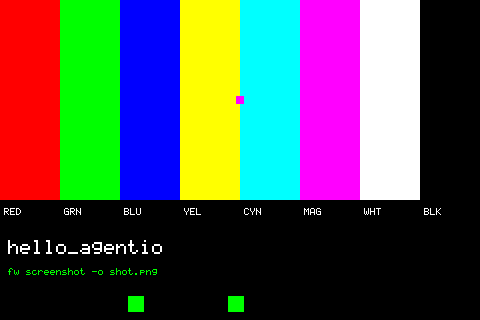

# WiliBSP's agent tools

WiliBSP ships a command-line tool, `tools/fw.py`, and an in-app harness
called **agentio** that let a person or an AI agent drive a real board over
the debug probe: press buttons, touch the screen, type, and take screenshots.
Its [`AGENTS.md`](https://github.com/freewili/wilibsp/blob/main/AGENTS.md)
workflow and Claude Code skills are built on them.

The emulator serves the same RTT channels on the same TCP ports that WiliBSP
uses with OpenOCD, so these commands work with no board attached.

## Using it

Start an app with `--rtt` (it works with or without a window):

```sh
build/bin/hello_agentio --rtt &
```

Then, from the WiliBSP folder:

```sh
cd third_party/wilibsp
python3 tools/fw.py press ok
python3 tools/fw.py touch 240 100
python3 tools/fw.py type "hello"
python3 tools/fw.py screenshot -o shot.png
```

| Command | Works | Notes |
|---|---|---|
| `fw press BUTTON` | yes | through agentio, the same path as on the board |
| `fw touch X Y` | yes | |
| `fw type TEXT` | yes | |
| `fw screenshot -o FILE` | yes | reads the app's own agentio framebuffer copy, exactly as on hardware |
| `fw rtt` | no | it starts OpenOCD itself; read `DIAG()` output from the emulator's terminal, or `nc 127.0.0.1 9090` |
| `fw build`, `fw flash`, `fw install-app` | — | these are for the real board |

The ports are 9090 (DIAG text) and 9091 (agentio), on 127.0.0.1 only.

These commands need the app built with agentio (`FW2_AGENTIO`), which is on
by default in native builds. The browser build leaves it off.



## With an AI agent

Because the commands and their output are the same, an agent following
WiliBSP's `AGENTS.md` can build an app for the emulator, run it with
`--rtt`, and verify it with `fw press` and `fw screenshot` before anyone
flashes a board. For agents that prefer files over sockets, headless
[input scripts](scripting.md) with `screenshot` commands and `.expect` log
checks do the same job without a background process.
